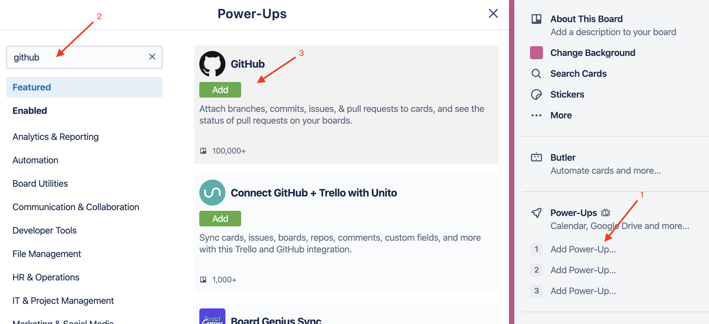

# Github and Trello Integration

## Objective

This document will guide you through a step-by-step process to integrate your
Trello board with Github.
This integration will help you to keep track of your Pull Requests and issues
within Trello.

### Technologies Discussed

- Github
- Trello

### References

[Github and Trello](https://blog.trello.com/github-and-trello-integrate-your-commits)

!!! Note
    Use GitHub Power-Up for Trello for attaching pull requests, issues,
    branches, and more to respective cards.

!!! Note
    Color coded to identify status of the PR such as open, merged, failed checks.

!!! Note
    You can also associate multiple repositories to one board.
    This is useful in a case where you are working on both frontend and backend
     from the same board.

### Add Github Power-Up to your Trello board

### Add repository

### Attach your Pull Request to Trello card

- PR now shows on the card. Color coded to show status of pull request

- A comment linking back to Trello will be automatically added to your PR

## Conclusion

Trello is a powerful but easy to use communication tool for your team.
You can extend it's capabilities by further integrating your Github repository
 using other platforms such as
  [Zapier](https://zapier.com/apps/github/integrations/trello) to
   automatically create tasks from Github issues, among other features.
